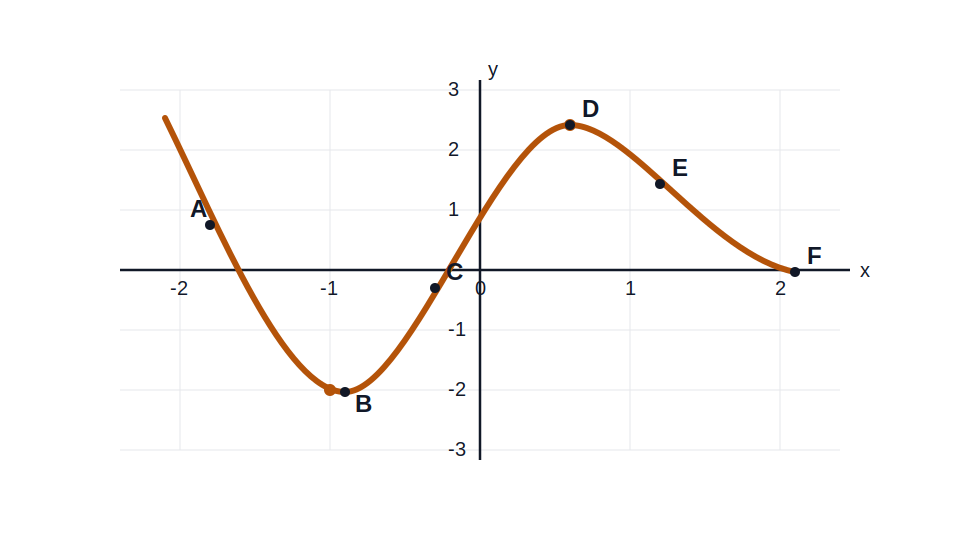

# Homework 4: Average Rate of Change and Concavity

## Instructions

Show your work clearly. When a problem asks about concavity from a table, compare average rates on equal input intervals.

## Part A: Average Rate of Change

1. In your own words, explain what average rate of change means on an interval.

2. For the function values

| $x$ | $1$ | $3$ | $6$ |
|---|---|---|---|
| $f(x)$ | $2$ | $8$ | $11$ |

find the average rate of change on:

- $[1,3]$
- $[3,6]$
- $[1,6]$

3. Let

$$
g(x)=4x-7
$$

Find the average rate of change on:

- $[0,5]$
- $[2,9]$

What do you notice?

4. Let

$$
h(x)=x^2+1
$$

Find the average rate of change on:

- $[0,2]$
- $[2,4]$

Which interval has the greater average rate of change?

5. Let

$$
p(x)=x^2-3x
$$

Find the average rate of change on $[-1,3]$.

## Part B: Reading Concavity from a Graph

6. Use the graph below to estimate:

- where the function is increasing
- where the function is decreasing
- where the function is concave down
- where the function is concave up

7. Use the graph below to estimate:

- where the function is increasing
- where the function is decreasing
- where the function is concave down
- where the function is concave up

## Part C: Reading Concavity from a Table

For Problems 8 to 10, assume the function does **not** change concavity on the stated interval.

8. The table gives values of a function on equal $1$-unit steps.

| $x$ | $0$ | $1$ | $2$ | $3$ |
|---|---|---|---|---|
| $f(x)$ | $4$ | $7$ | $12$ | $19$ |

- Find the average rate of change on each interval.
- Decide whether the function is concave up or concave down.

9. The table gives values of a function on equal $1$-unit steps.

| $x$ | $-1$ | $0$ | $1$ | $2$ |
|---|---|---|---|---|
| $f(x)$ | $10$ | $6$ | $3$ | $1$ |

- Find the average rate of change on each interval.
- Decide whether the function is concave up or concave down.

10. The table gives values of a function on equal $2$-unit steps.

| $x$ | $0$ | $2$ | $4$ | $6$ |
|---|---|---|---|---|
| $f(x)$ | $1$ | $5$ | $11$ | $19$ |

- Find the average rate of change on each interval.
- Decide whether the function is concave up or concave down.

11. A function is decreasing on an interval, but its average rates on equal steps are

$$
-8,\ -5,\ -2
$$

Is the function concave up or concave down? Explain.

## Part D: Mixed Review

12. Can a function be increasing and concave down at the same time? Explain briefly.

13. Can a function be decreasing and concave up at the same time? Explain briefly.

14. Write a table with four $x$-values on equal intervals that shows a function that is:

- increasing
- concave up

15. Write a table with four $x$-values on equal intervals that shows a function that is:

- decreasing
- concave down

## Challenge

16. A function has these average rates of change on consecutive equal intervals:

$$
3,\ 1,\ -1,\ -3
$$

Describe what this tells you about:

- the concavity
- whether the function is always increasing, always decreasing, or changes behavior
