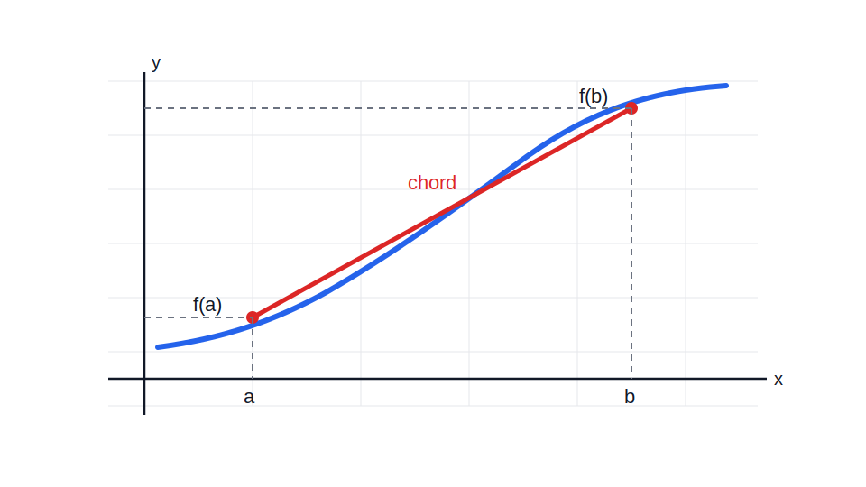
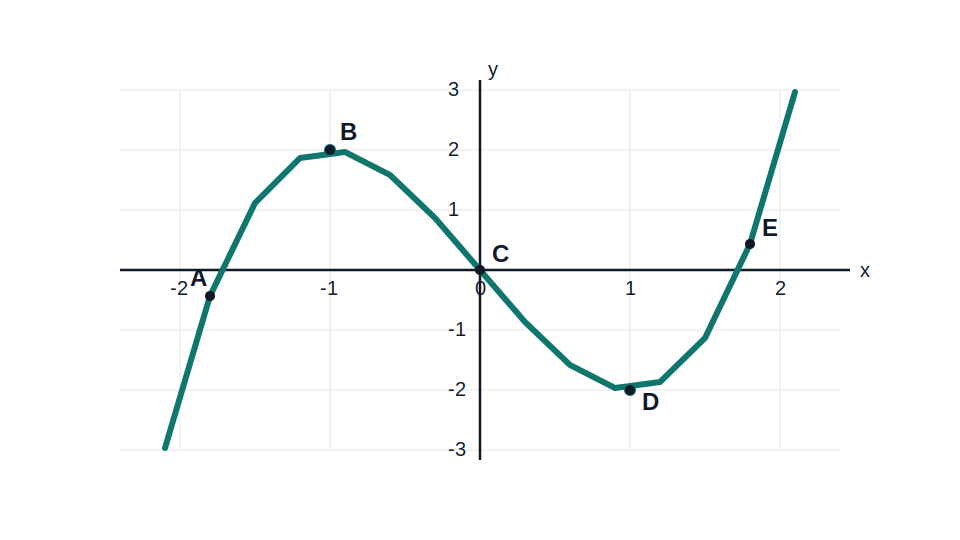

# Lesson 4
## Average Rate of Change and Concavity

Precalculus

---

# Learning Goals

By the end of this lesson, you should be able to:

- compute average rate of change on an interval;
- interpret average rate of change from a table, graph, or formula;
- explain what the sign of the average rate of change means;
- define concavity as the increase or decrease of the rate of change;
- identify concave up and concave down from a graph;
- use tables to decide concavity when the concavity does not change.

---

# Big Idea

In Lesson 3, we described whether a function goes up or down.

Now we ask a new question:

- how fast is it changing over an interval?

Today we focus on **average** rate of change, not limits or instantaneous rate of change.

---

# Average Rate of Change

For a function $f$ on the interval $[a,b]$,

$$
\text{average rate of change}=\frac{f(b)-f(a)}{b-a}
$$

This means:

$$
\frac{\text{change in output}}{\text{change in input}}
$$

---

# Graph Meaning of Average Rate

---

# What the Number Tells Us

- positive average rate: the function rises overall on the interval;
- negative average rate: the function falls overall on the interval;
- zero average rate: the endpoints have the same output;
- larger absolute value: steeper average change.

---

# First Example

Suppose

$$
f(1)=4,\qquad f(3)=10
$$

Then on $[1,3]$,

$$
\frac{f(3)-f(1)}{3-1}=\frac{10-4}{2}=3
$$

So the output increases by an average of $3$ units for each $1$ unit increase in $x$.

---

# Class Practice 1

The table shows values of a function.

| $x$ | $-1$ | $1$ | $4$ |
|---|---|---|---|
| $f(x)$ | $5$ | $1$ | $7$ |

Find the average rate of change on:

1. $[-1,1]$
2. $[1,4]$

Then say whether each rate is positive or negative.

---

# Example from a Formula

Consider

$$
f(x)=x^2
$$

On $[1,3]$,

$$
\frac{f(3)-f(1)}{3-1}=\frac{9-1}{2}=4
$$

On $[-2,2]$,

$$
\frac{f(2)-f(-2)}{2-(-2)}=\frac{4-4}{4}=0
$$

The same function can have different average rates on different intervals.

---

# Class Practice 2

Find the average rate of change.

1. $g(x)=3x-2$ on $[0,5]$
2. $h(x)=x^2-x$ on $[2,4]$

Which interval has the greater average rate of change?

---

# A New Pattern

Sometimes a function is increasing the whole time, but not at a constant rate.

Example idea:

- first it rises slowly;
- later it rises more quickly.

So we ask:

- is the **rate of change** increasing or decreasing?

This leads to **concavity**.

---

# Concavity

In this course, we define concavity this way:

- a function is **concave up** on an interval if its rate of change is increasing;
- a function is **concave down** on an interval if its rate of change is decreasing.

We will usually judge this from a **graph** or a **table**.

---

# Equal-Step Table Idea

Look at the table.

| $x$ | $0$ | $1$ | $2$ | $3$ |
|---|---|---|---|---|
| $f(x)$ | $1$ | $2$ | $5$ | $10$ |

Average rates over each $1$-unit interval:

- from $0$ to $1$: $1$
- from $1$ to $2$: $3$
- from $2$ to $3$: $5$

The rates are increasing, so the function is **concave up**.

---

# Important Subtlety

Look at this table.

| $x$ | $0$ | $1$ | $2$ | $3$ |
|---|---|---|---|---|
| $f(x)$ | $8$ | $5$ | $3$ | $2$ |

Average rates:

- $-3$
- $-2$
- $-1$

The function is decreasing, but the rates are increasing.

So the function is still **concave up**.

---

# Class Practice 3

For each list of average rates on equal input intervals, decide whether the function is concave up or concave down.

1. $6,\ 4,\ 1,\ -2$
2. $-5,\ -1,\ 2,\ 6$

Explain your choice in one sentence.

---

# Graph View of Concavity

From a graph:

- **concave up** means the slopes tend to increase;
- **concave down** means the slopes tend to decrease.

Visual clue:

- concave up bends like a cup;
- concave down bends like a cap.

---

# Graph Reading Strategy

When reading a graph:

1. First decide where the function is increasing or decreasing.
2. Then ask whether the rate of change is getting larger or smaller.
3. Use approximate intervals from visible turning points and bending points.

---

# Class Practice 4

Use the graph to estimate:

- where the function is increasing;
- where the function is decreasing;
- where it is concave down;
- where it is concave up.

---

---

# One Reasonable Reading

For the graph on the previous slide, a reasonable estimate is:

- increasing on about $(-\infty,-1]$ and $[1,\infty)$;
- decreasing on about $[-1,1]$;
- concave down for $x<0$;
- concave up for $x>0$.

The exact numbers are less important than reading the shape correctly.

---

# Table-Based Concavity Problem

Suppose the table gives:

| $x$ | $0$ | $1$ | $2$ | $3$ |
|---|---|---|---|---|
| $f(x)$ | $6$ | $5$ | $2$ | $-3$ |

Assume the function does **not** change concavity on $[0,3]$.

Average rates over each $1$-unit interval:

- $-1$
- $-3$
- $-5$

The rates are decreasing, so the function is **concave down**.

---

# Class Practice 5

A function has the values:

| $x$ | $0$ | $2$ | $4$ | $6$ |
|---|---|---|---|---|
| $f(x)$ | $3$ | $7$ | $15$ | $27$ |

Assume the function does **not** change concavity on $[0,6]$.

1. Find the average rate of change on each $2$-unit interval.
2. Decide whether the function is concave up or concave down.

---

# Class Practice 6

The table gives the average rate of change of a function on consecutive equal intervals.

| Interval | $[0,1]$ | $[1,2]$ | $[2,3]$ | $[3,4]$ |
|---|---|---|---|---|
| Average rate of change | $-4$ | $-1$ | $2$ | $5$ |

Assume the function does **not** change concavity on $[0,4]$.

Is the function concave up or concave down? Explain how you know.

---

# Important Caution

Without calculus, concavity from a formula alone can be hard to determine.

So in this unit, our main tools are:

- graphs for qualitative interval reading;
- tables with equal input steps;
- the extra statement that concavity does not change, when needed.

---

# Summary

- Average rate of change on $[a,b]$ is

$$
\frac{f(b)-f(a)}{b-a}
$$

- It measures average change in output per unit change in input.
- Concavity describes whether the rate of change is increasing or decreasing.
- A function can be decreasing and still be concave up.
- In precalculus, we usually identify concavity from graphs and tables.

---

# Summary Table

| Rate of change idea | Function property |
|---|---|
| positive | increasing |
| negative | decreasing |
| increasing | concave up |
| decreasing | concave down |

Use this table as a quick way to translate between

- what the rates are doing;
- what the function is doing.

---

# Exit Ticket

1. Find the average rate of change of $f(x)=x^2$ on $[2,5]$.
2. If the average rates on equal intervals are $4,\ 1,\ -2$, is the function concave up or concave down?
3. Can a function be decreasing and concave up at the same time? Explain briefly.
