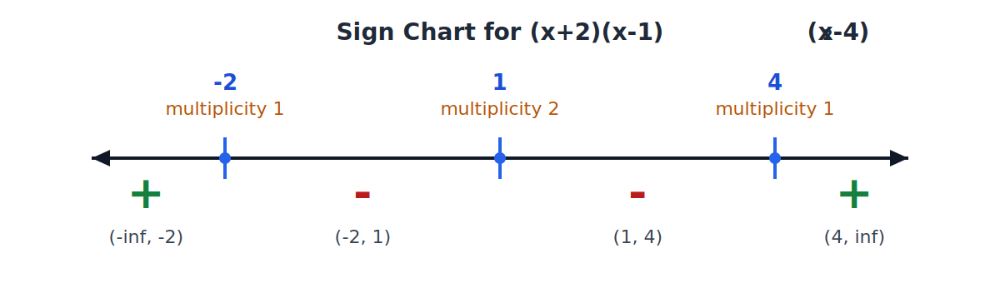
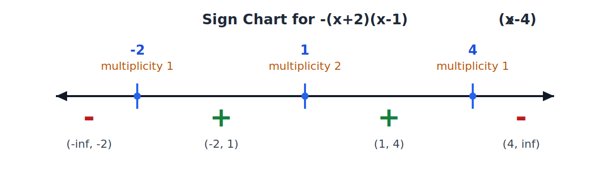
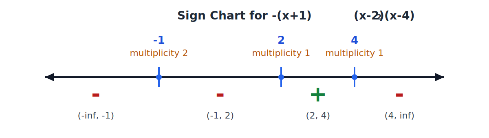
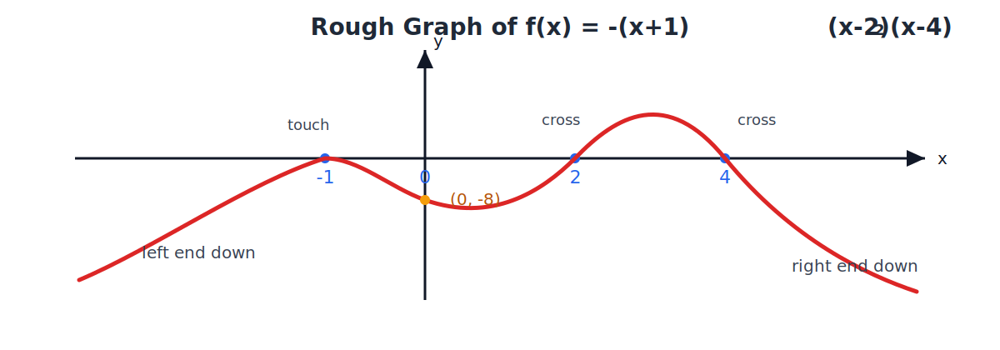

# Lesson 7
## General Polynomial in Factorized Form

Precalculus

---

# Learning Goals

By the end of this lesson, you should be able to:

- identify the roots and multiplicities from a polynomial in factorized form;
- use multiplicity to decide whether the graph crosses or touches the $x$-axis;
- solve inequalities such as $f(x)>0$ and $f(x)<0$ from factorized form;
- sketch a rough graph of a polynomial from its factorized form.

---

# Big Idea

Factorized form shows the important structure of a polynomial:

- where the roots are;
- how many times each root repeats;
- where the polynomial is positive or negative;
- how the graph behaves near each root.

---

# Knowledge Point 1

A general polynomial in factorized form can be written as

$$
f(x)=a(x-r_1)^{k_1}(x-r_2)^{k_2}\cdots (x-r_m)^{k_m},
$$

where $a\ne 0$.

- The roots are $r_1,r_2,\dots,r_m$.
- The multiplicity of root $r_i$ is $k_i$.
- The degree is

$$
k_1+k_2+\cdots +k_m.
$$

---

# Worked Example 1

For

$$
f(x)=2(x+3)^2(x-1)(x-4)^3,
$$

identify the roots, multiplicities, and degree.

- Root $-3$ has multiplicity $2$.
- Root $1$ has multiplicity $1$.
- Root $4$ has multiplicity $3$.
- Degree $=2+1+3=6$.

---

# Class Practice 1

For each polynomial, list the roots, multiplicities, and degree.

1. $(x-2)^3(x+5)^2$
2. $-3(x+1)^4(x-6)$
3. $5(x-3)^2(x+2)^2$

---

# Knowledge Point 3

To solve $f(x)>0$ or $f(x)<0$ from factorized form:

1. find all real roots;
2. mark them on a number line;
3. test the sign on each interval;
4. remember:

- an odd multiplicity changes the sign;
- an even multiplicity keeps the same sign.

---

# Worked Example 2

Solve

$$
(x+2)(x-1)^2(x-4)>0.
$$

Roots: $-2,\ 1,\ 4$, with multiplicities $1,\ 2,\ 1$.

The sign chart shows $+,\ -,\ -,\ +$ on the four intervals.

So the solution is

$$
(-\infty,-2)\cup(4,\infty).
$$

---

# Worked Example 2 Continued

Now solve

$$
-(x+2)(x-1)^2(x-4)>0.
$$

The roots and multiplicities stay the same, but the negative leading coefficient flips every sign.

The sign chart shows $-,\ +,\ +,\ -$ on the four intervals.

So the solution is

$$
(-2,1)\cup(1,4).
$$

---

# Class Practice 2

Solve each inequality.

1. $(x-3)(x+1)^2<0$
2. $-(x+4)(x-2)>0$
3. $(x+2)^2(x-5)<0$

---

# Knowledge Point 4

To sketch a rough graph from factorized form:

1. determine the roots;
2. determine the sign of the polynomial on each interval;
3. determine the end behavior, described below;
4. determine the local behavior at each root, described below.

---

# End Behavior

- The polynomial goes to infinity when $x$ goes to either positive infinity or negative infinity.
- The sign of that infinity is determined by the sign of the polynomial on the outer intervals.

---

# Local Behavior at a Root

- If the sign changes across the root, then the graph crosses the $x$-axis.
- If the sign stays the same across the root, then the graph just touches the $x$-axis.

---

# Worked Example 3

Sketch a rough graph of

$$
f(x)=-(x+1)^2(x-2)(x-4).
$$

- Roots: $-1,\ 2,\ 4$.
- Use the sign chart:

- So the left end goes to $-\infty$, and the right end also goes to $-\infty$.
- At $x=-1$, the sign stays negative, so the graph touches the $x$-axis.
- At $x=2$ and $x=4$, the sign changes, so the graph crosses the $x$-axis.

---

# Worked Example 3 Continued

---

# Class Practice 3

For each polynomial:

1. state the end behavior;
2. say whether the graph crosses or touches at each root;
3. sketch a rough graph.

1. $(x+2)(x-1)^2$
2. $-(x-3)^3(x+1)$
3. $2(x+4)^2(x-2)^2$

---

# Summary

For

$$
f(x)=a(x-r_1)^{k_1}\cdots (x-r_m)^{k_m},
$$

- the roots are $r_1,\dots,r_m$;
- the multiplicities are $k_1,\dots,k_m$;
- odd multiplicity means cross;
- even multiplicity means touch;
- roots split the number line into sign intervals;
- the outer intervals determine the end behavior.

---

# Exit Ticket

For

$$
f(x)=-(x+3)(x-1)^2,
$$

answer the following:

1. List the roots and multiplicities.
2. Solve $f(x)>0$.
3. State the end behavior and whether the graph crosses or touches at each root.
