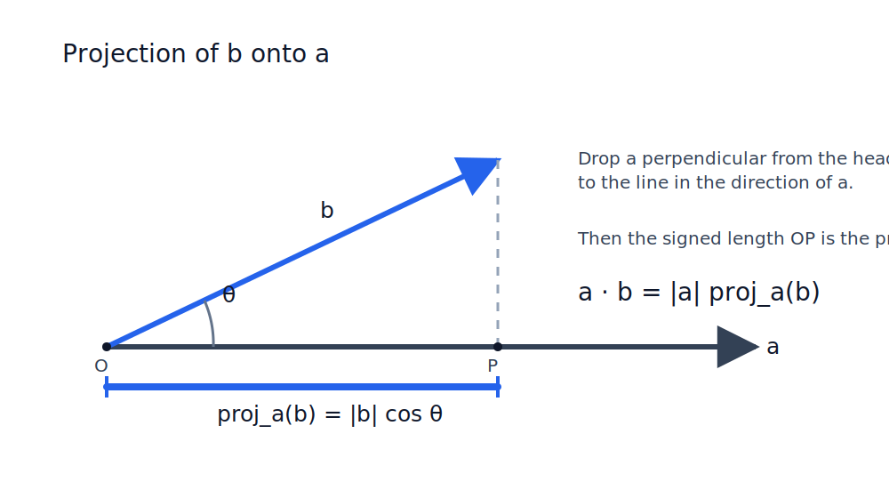
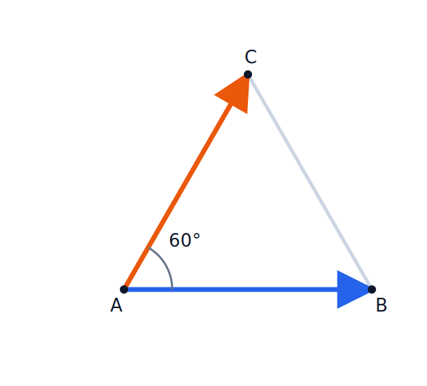
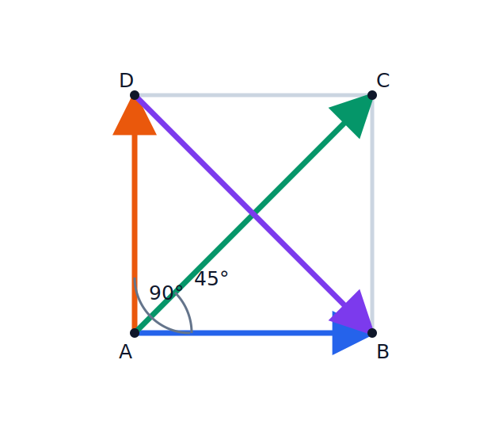
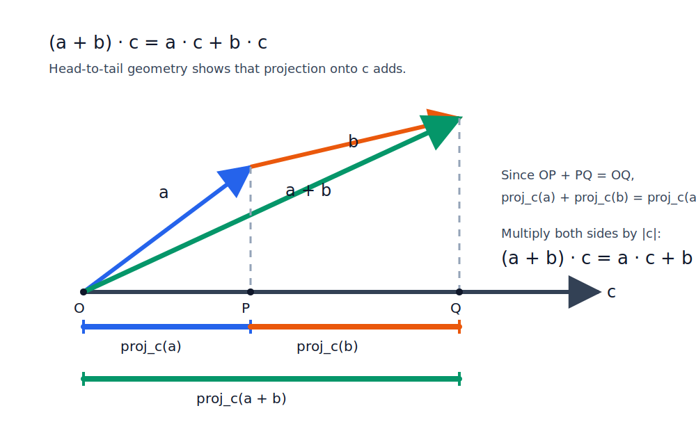

# Lesson 2
## Dot Product

Precalculus

---

# Learning Goals

By the end of this lesson, you should be able to:

- define the dot product geometrically;
- compute a dot product from an angle or from coordinates;
- explain what the sign of a dot product tells us;
- test whether two vectors are perpendicular;
- prove the coordinate formula for vectors in the plane.

$$
\langle x_0,y_0\rangle \cdot \langle x_1,y_1\rangle = x_0x_1+y_0y_1.
$$

---

# Why We Need a New Product

Here are three natural questions about vectors:

1. Given $\langle 4,7\rangle$, find its length.
2. Given $\langle 1,6\rangle$ and $\langle -5,2\rangle$, decide whether they are perpendicular.
3. Given $\langle 3,5\rangle$ and $\langle 5,2\rangle$, find the angle between them.

The first question is doable with the Pythagorean theorem.

The second question might still be guessed by a smart student.

But the third question is not easy with our current tools.

We want one operation that helps us answer all of these questions.

That operation is the **dot product**.

---

# Geometric Definition

For vectors $\vec{a}$ and $\vec{b}$ with angle $\theta$ between them:

$$
\vec{a}\cdot\vec{b}=|\vec{a}|\,|\vec{b}|\cos\theta
$$

This means:

- take the length of one vector;
- multiply by the projected length of the other;
- include a sign through $\cos\theta$.

---

# Projection View

From

$$
\vec{a}\cdot\vec{b}=|\vec{a}|\,|\vec{b}|\cos\theta
$$

we can read:

$$
\vec{a}\cdot\vec{b}=|\vec{a}|\bigl(\text{signed projection of }\vec{b}\text{ onto }\vec{a}\bigr)
$$

or symmetrically

$$
\vec{a}\cdot\vec{b}=|\vec{b}|\bigl(\text{signed projection of }\vec{a}\text{ onto }\vec{b}\bigr).
$$

---

# Projection Picture

The blue segment on $\vec{a}$ is the signed projection of $\vec{b}$ onto $\vec{a}$.

---

# What the Sign Means

Because the sign comes from $\cos\theta$:

- if $0^\circ \le \theta < 90^\circ$, then $\vec{a}\cdot\vec{b}>0$;
- if $\theta=90^\circ$, then $\vec{a}\cdot\vec{b}=0$;
- if $90^\circ < \theta \le 180^\circ$, then $\vec{a}\cdot\vec{b}<0$.

So the dot product tells us whether vectors point mostly together, are perpendicular, or point mostly opposite.

---

# Quick Examples from Angles

If $|\vec{a}|=3$, $|\vec{b}|=5$, and $\theta=60^\circ$, then

$$
\vec{a}\cdot\vec{b}=3\cdot 5 \cdot \cos 60^\circ=\frac{15}{2}.
$$

If $\theta=90^\circ$, then

$$
\vec{a}\cdot\vec{b}=0.
$$

If $\theta=180^\circ$, then

$$
\vec{a}\cdot\vec{b}=-|\vec{a}|\,|\vec{b}|.
$$

---

# Class Practice 1

|  |  |
|---|---|
|  | In the equilateral triangle, all sides have length $4$. |
|  | Find: |
|  | 1. $\vec{AB}\cdot\vec{AC}$ |
|  | 2. $\vec{CA}\cdot\vec{CB}$ |
|  | 3. $\vec{AB}\cdot\vec{AB}$ |

---

# Class Practice 2

|  |  |
|---|---|
|  | In the square, each side has length $3$. |
|  | Find: |
|  | 1. $\vec{AB}\cdot\vec{AD}$ |
|  | 2. $\vec{AB}\cdot\vec{AC}$ |
|  | 3. $\vec{AD}\cdot\vec{AD}$ |
|  | 4. $\vec{AC}\cdot\vec{AC}$ |

---

# Class Practice 3

|  |  |
|---|---|
|  | In the square, each side has length $3$. |
|  | Find: |
|  | 1. $\vec{AC}\cdot\vec{DB}$ |
|  | 2. $\vec{AD}\cdot\vec{DB}$ |
|  | Explain which angle in the figure you used each time. |

---

# Dot Product of a Vector with Itself

Set $\vec{a}=\vec{b}$.

Then $\theta=0$ and $\cos 0 = 1$, so

$$
\vec{a}\cdot\vec{a}=|\vec{a}|^2.
$$

This is useful because it connects dot product to length.

In coordinates, it will become

$$
\langle x,y\rangle\cdot\langle x,y\rangle=x^2+y^2.
$$

---

# Coordinate Formula

For vectors in the plane,

$$
\langle x_0,y_0\rangle\cdot\langle x_1,y_1\rangle=x_0x_1+y_0y_1.
$$

We will use this formula for calculations first.

The proof will be moved to the appendix at the end.

---

# Coordinate Formula Example

Let

$$
\vec{u}=\langle 2,3\rangle,\qquad \vec{v}=\langle 4,-1\rangle.
$$

Then

$$
\vec{u}\cdot\vec{v}=2\cdot 4+3\cdot(-1)=8-3=5.
$$

Because the result is positive, the angle between them is acute.

---

# Coordinate Example

Let

$$
\vec{u}=\langle -2,5\rangle,\qquad \vec{v}=\langle 3,4\rangle.
$$

Then

$$
\vec{u}\cdot\vec{v}=(-2)\cdot 3+5\cdot 4=-6+20=14.
$$

Again the result is positive, so the angle is acute.

---

# Coordinate Practice

Compute each dot product:

1. $\langle 1,2\rangle\cdot\langle 3,4\rangle$
2. $\langle -2,5\rangle\cdot\langle 6,-1\rangle$
3. $\langle 0,7\rangle\cdot\langle 4,2\rangle$
4. $\langle -3,-2\rangle\cdot\langle -5,1\rangle$

---

# Coordinate Practice

Compute each dot product:

1. $\langle 8,1\rangle\cdot\langle 2,-3\rangle$
2. $\langle -4,6\rangle\cdot\langle -1,-2\rangle$
3. $\langle 5,-5\rangle\cdot\langle 5,5\rangle$
4. $\langle 9,0\rangle\cdot\langle -2,7\rangle$

---

# Perpendicular Test

Two nonzero vectors are perpendicular exactly when

$$
\vec{a}\cdot\vec{b}=0.
$$

Example:

$$
\langle 2,3\rangle\cdot\langle 3,-2\rangle=2\cdot 3+3\cdot(-2)=6-6=0.
$$

So these vectors are perpendicular.

---

# Magnitude from Coordinates

Since

$$
\vec{a}\cdot\vec{a}=|\vec{a}|^2,
$$

for $\vec{a}=\langle x,y\rangle$ we get

$$
|\vec{a}|=\sqrt{\vec{a}\cdot\vec{a}}=\sqrt{x^2+y^2}.
$$

This matches the distance formula.

---

# Perpendicular and Length Practice

For each pair, decide whether the two vectors are perpendicular:

1. $\langle 2,3\rangle$ and $\langle 3,-2\rangle$
2. $\langle 4,1\rangle$ and $\langle -2,8\rangle$
3. $\langle -5,2\rangle$ and $\langle 6,3\rangle$
4. $\langle 7,-1\rangle$ and $\langle 2,14\rangle$

---

# Perpendicular and Length Practice

Find the magnitude of each vector:

1. $\langle 3,4\rangle$
2. $\langle -8,6\rangle$
3. $\langle 5,-12\rangle$
4. $\langle -1,-1\rangle$

---

# Finding an Angle from Coordinates

If

$$
\vec{a}\cdot\vec{b}=|\vec{a}|\,|\vec{b}|\cos\theta,
$$

then

$$
\cos\theta=\frac{\vec{a}\cdot\vec{b}}{|\vec{a}|\,|\vec{b}|}.
$$

So coordinates let us compute angles between vectors.

---

# Class Practice

1. Compute $\langle 1,4\rangle\cdot\langle 3,2\rangle$.
2. Decide whether $\langle 5,-1\rangle$ and $\langle 1,5\rangle$ are perpendicular.
3. Find $|\langle -3,4\rangle|$.
4. Find the angle between $\langle 1,0\rangle$ and $\langle 1,1\rangle$.

---

# Summary

| Topic | Geometry Side | Algebra Side |
|---|---|---|
| Calculate dot product | $\vec{a}\cdot\vec{b}=\|\vec{a}\|\,\|\vec{b}\|\cos\theta$ | $\langle x_0,y_0\rangle\cdot\langle x_1,y_1\rangle=x_0x_1+y_0y_1$ |
| Perpendicular test | $\vec{a}\perp\vec{b}$ | $\vec{a}\cdot\vec{b}=0$ |
| Length | $\|\vec{a}\|^2=x^2+y^2$ by Pythagorean theorem | $\vec{a}\cdot\vec{a}=x^2+y^2$ by dot product formula |

Angle calculation:

$$
\cos\theta=\dfrac{\vec{a}\cdot\vec{b}}{\|\vec{a}\|\,\|\vec{b}\|}
=\dfrac{x_0x_1+y_0y_1}{\sqrt{x_0^2+y_0^2}\sqrt{x_1^2+y_1^2}}
$$

---

# Appendix
## Proof of the Coordinate Formula

---

# Distributive Law from Geometry

The projection of $\vec{a}+\vec{b}$ onto $\vec{c}$ is the sum of the projections of $\vec{a}$ and $\vec{b}$ onto $\vec{c}$.

So

$$
(\vec{a}+\vec{b})\cdot\vec{c}=\vec{a}\cdot\vec{c}+\vec{b}\cdot\vec{c}.
$$

---

# Linearity with Scalars

If we stretch a vector by a scalar $k$, its projection also stretches by $k$.

So the dot product is compatible with scalar multiplication:

$$
(k\vec{a})\cdot\vec{b}=k(\vec{a}\cdot\vec{b})
$$

and similarly

$$
\vec{a}\cdot(k\vec{b})=k(\vec{a}\cdot\vec{b}).
$$

These two facts let us move from geometry to coordinates.

---

# Standard Basis Vectors

Let

$$
\vec{i}=\langle 1,0\rangle,\qquad \vec{j}=\langle 0,1\rangle.
$$

These are unit vectors along the coordinate axes.

Because they are perpendicular and each has length $1$:

$$
\vec{i}\cdot\vec{i}=1,\qquad \vec{j}\cdot\vec{j}=1,\qquad \vec{i}\cdot\vec{j}=0.
$$

Also $\vec{j}\cdot\vec{i}=0$.

---

# Writing a Vector in Basis Form

Any vector in the plane can be written as

$$
\vec{u}=\langle x_0,y_0\rangle=x_0\vec{i}+y_0\vec{j}
$$

and

$$
\vec{v}=\langle x_1,y_1\rangle=x_1\vec{i}+y_1\vec{j}.
$$

Now we can expand $\vec{u}\cdot\vec{v}$ using distributivity.

---

# Proof of the Coordinate Formula

Let

$$
\vec{u}=x_0\vec{i}+y_0\vec{j},\qquad \vec{v}=x_1\vec{i}+y_1\vec{j}.
$$

Then

$$
\vec{u}\cdot\vec{v}
=(x_0\vec{i}+y_0\vec{j})\cdot(x_1\vec{i}+y_1\vec{j}).
$$

By distributivity,

$$
=x_0x_1(\vec{i}\cdot\vec{i})+x_0y_1(\vec{i}\cdot\vec{j})+y_0x_1(\vec{j}\cdot\vec{i})+y_0y_1(\vec{j}\cdot\vec{j}).
$$

---

# Coordinate Formula Simplified

Using

$$
\vec{i}\cdot\vec{i}=1,\qquad \vec{j}\cdot\vec{j}=1,\qquad \vec{i}\cdot\vec{j}=\vec{j}\cdot\vec{i}=0,
$$

we get

$$
\vec{u}\cdot\vec{v}=x_0x_1+y_0y_1.
$$

So for coordinate vectors:

$$
\langle x_0,y_0\rangle\cdot\langle x_1,y_1\rangle=x_0x_1+y_0y_1.
$$
